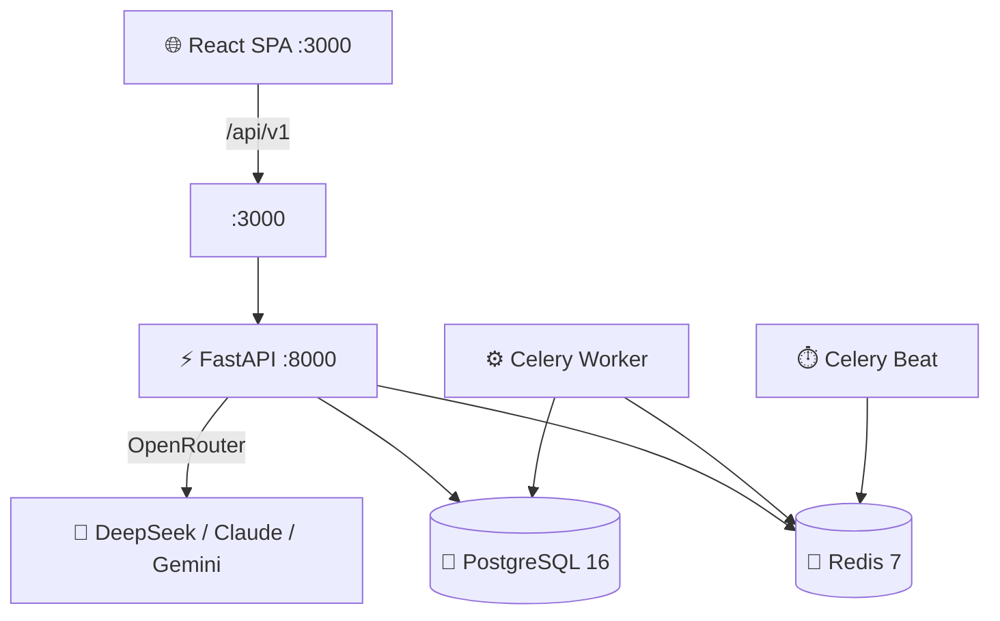

# 🏋️ Aaron 2.0

> AI-powered grocery tracking, meal planning, and health metrics — built to help you **lose weight, lower cholesterol, and lower blood pressure**. 💪🫀


---

## ✨ Features

- 🧾 **Receipt Parsing** — Paste a grocery receipt and AI extracts items into your pantry
- 🥫 **Pantry Tracking** — Track stock levels, expiry dates, and low-stock alerts
- 🍽️ **Meal Planner** — AI-generated weekly meal plans using DASH diet principles
- 📖 **Recipe Library** — Browse, save, and generate recipes with step-by-step instructions
- 📊 **Health Metrics** — Track blood pressure, weight, and cholesterol with trend charts
- 🤖 **AI Health Coach** — Chat with an AI coach for personalized nutrition guidance
- 🛒 **Shopping Lists** — Auto-generated lists based on meal plans and pantry gaps
- 📝 **Food Logging** — Log meals with full macro and micronutrient tracking
- 📈 **Dashboard** — Health cards, nutrition rings, pantry alerts, AI insights at a glance

## 🏗️ Architecture



## 🧪 Tech Stack

| Layer | Tech |
|-------|------|
| 🎨 **Frontend** | React 18, TypeScript, Vite, Tailwind CSS, shadcn/ui, TanStack Query, Zustand, Recharts |
| ⚡ **Backend** | Python 3.12, FastAPI, SQLModel, Alembic |
| 🐘 **Database** | PostgreSQL 16 |
| ⚙️ **Queue** | Celery + Redis |
| 🤖 **AI** | OpenRouter API (DeepSeek, Claude, Gemini, Llama) |
| 🐳 **Infra** | Docker Compose, Nginx, GitHub Actions CI/CD |

## 🚀 Quick Start

### Prerequisites

- 🐳 [Docker](https://docs.docker.com/get-docker/) & Docker Compose
- 🔑 An [OpenRouter](https://openrouter.ai/) API key

### 1️⃣ Clone & configure

```bash
git clone https://github.com/your-username/aaron2.git
cd aaron2
cp .env.example .env
```

Edit `.env` and set your `OPENROUTER_API_KEY`. 🔐

### 2️⃣ Start everything

```bash
docker compose up -d --build
```

This starts:
- 🌐 **App** (Nginx + FastAPI + frontend) → `http://localhost:3000`
- 🐘 **PostgreSQL** → `localhost:5432`
- 🔴 **Redis** → `localhost:6379`
- ⚙️ **Celery** worker + beat for background tasks

### 3️⃣ Open the app

Navigate to **http://localhost:3000** — no login required (single-user app). 🎉

## 🔑 Environment Variables

See `.env.example` for all variables. Key ones:

| Variable | Description |
|----------|-------------|
| `OPENROUTER_API_KEY` | 🤖 API key for AI features |
| `SECRET_KEY` | 🔐 App secret — change in production |
| `POSTGRES_PASSWORD` | 🐘 Database password |
| `DEBUG` | 🐛 Set to `false` in production |

## 📁 Project Structure

```
aaron2/
├── 📂 backend/
│   ├── app/
│   │   ├── api/v1/          # 🔌 FastAPI route handlers
│   │   ├── models/          # 📦 SQLModel database models
│   │   ├── services/        # 🧠 Business logic & AI service
│   │   ├── tasks/           # ⏱️ Celery background tasks
│   │   └── main.py          # 🚀 App entrypoint & lifespan
│   ├── alembic/             # 🔄 Database migrations
│   ├── tests/               # ✅ Pytest test suite
│   └── Dockerfile
├── 📂 frontend/
│   ├── src/
│   │   ├── pages/           # 📄 Page components
│   │   ├── components/      # 🧩 Reusable UI components
│   │   ├── api/             # 🔗 API client functions
│   │   ├── stores/          # 🗃️ Zustand state stores
│   │   └── types/           # 📝 TypeScript type definitions
│   └── index.html
├── 📂 nginx/                # ⚡ Nginx reverse proxy config
├── 🐳 docker-compose.yml    # Production compose
├── 🛠️ docker-compose.dev.yml # Development compose
└── 📂 .github/workflows/    # 🔁 CI/CD pipelines
```

## 🧑‍💻 Development

### 🐍 Backend

```bash
cd backend
pip install ".[dev]"

# Lint & format
ruff check . && ruff format --check .

# Tests
pytest -v --cov=app
```

### ⚛️ Frontend

```bash
cd frontend
npm install
npm run dev      # 🔥 Vite dev server on :5173
npm run test     # ✅ Vitest
npm run build    # 📦 Production build
npx tsc --noEmit # 🔍 Type check
```

## 🤖 AI Model Strategy

Aaron 2.0 uses [OpenRouter](https://openrouter.ai/) to route AI calls to the best model per task:

| Task | Model | Why |
|------|-------|-----|
| 🧾 Receipt parsing | DeepSeek V3.2 | Complex extraction |
| 🍽️ Recipe & meal planning | DeepSeek V3.2 | Nutritional reasoning |
| 💬 Health coaching | Claude Sonnet 4.6 | Nuanced guidance |
| 🏷️ Classification | Gemini 3 Flash | Fast & cheap |
| 📊 Macro estimation | Gemini 3 Flash | Low latency |

All AI responses are cached in Redis (24h TTL) and costs are tracked in the database. 💰

## 📜 License

[MIT](./LICENSE.md) — do whatever you want with it! 🎉
